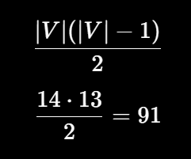

| Propriedade                 | Resultado                                |   |    |
| --------------------------- | ---------------------------------------- | - | -- |
| Tipo                        | Simples, não direcionado e não ponderado |   |    |
| Representação computacional | Implícita sobre matriz de caracteres     |   |    |
| Ordem (                     | V                                        | ) | 14 |
| Tamanho (                   | E                                        | ) | 14 |
| Grau mínimo (\delta(G))     | 1                                        |   |    |
| Grau máximo (\Delta(G))     | 3                                        |   |    |
| Grau médio                  | 2                                        |   |    |
| Componentes conexas         | 1                                        |   |    |
| Distância (d(A,B))          | 9                                        |   |    |
| Densidade                   | aproximadamente 15,38%                   |   |    |
| Ciclos independentes        | 1                                        |   |    |
| É regular?                  | Não                                      |   |    |
| É conexo?                   | Sim                                      |   |    |
| Caminho mínimo apresentado  | `LDDRRRRRU`                              |   |    |
---
ele é esparso porque possui poucas arestas em relação ao máximo possível;\
a representação implícita é adequada porque as arestas podem ser calculadas diretamente pelas coordenadas.\
\
Quantidade Possível de arestas
---
Como o grafo é esparso, uma matriz de adjacência desperdiçaria memória. Poderíamos utilizar uma lista de adjacência, mas, como o grafo vem de uma grade regular e os vizinhos de cada célula podem ser calculados diretamente pelas quatro direções, a lista seria redundante. Por isso, a representação implícita sobre a própria matriz é a escolha mais adequada.